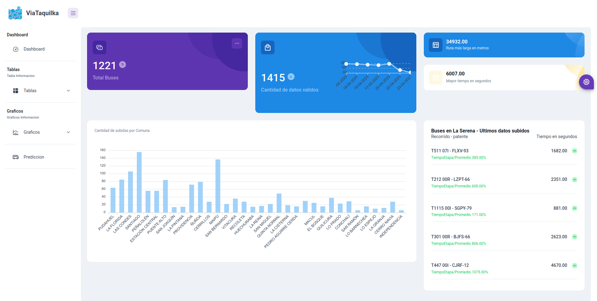
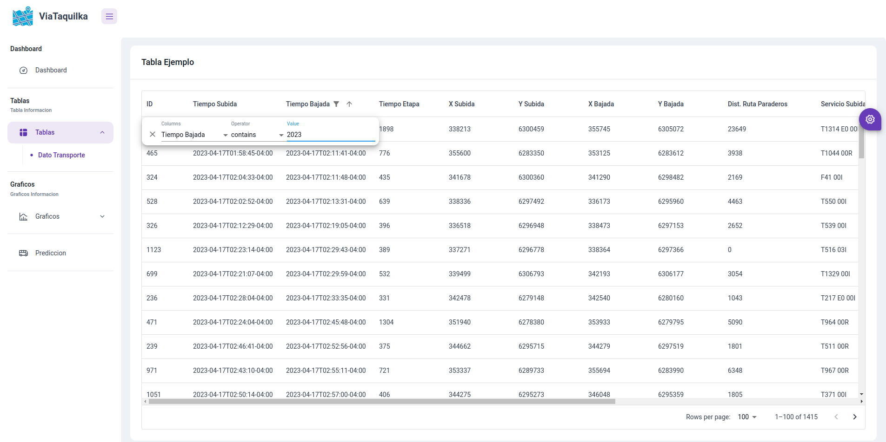
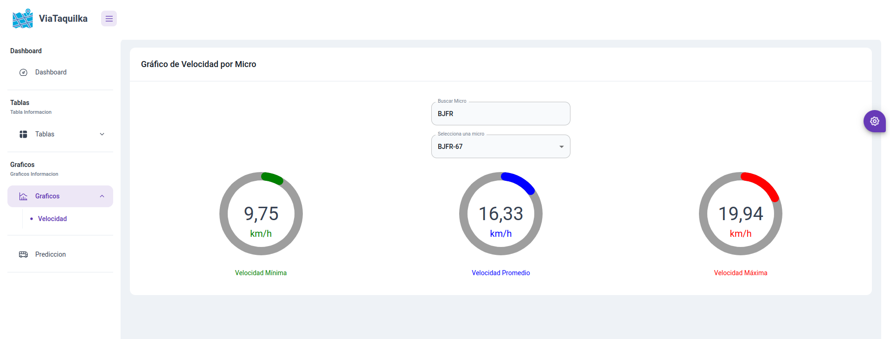
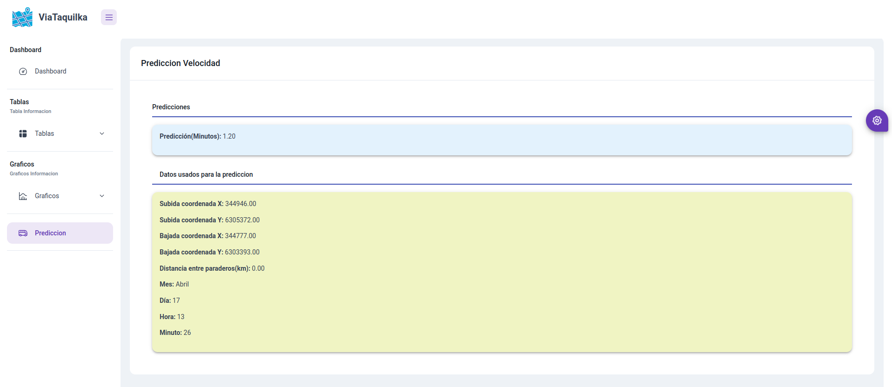

# Mlops BusTimeAI

## Plantilla usada
### Frontend
https://github.com/codedthemes/berry-free-react-admin-template
### backend
https://github.com/cglusky/docker-django-react

## Trabajo en progreso

Este proyecto calcula el tiempo que una micro tarda en viajar entre diferentes paraderos. Utiliza una arquitectura basada en Docker con un backend en Django y flask para la api encargada de hacer las predicciones y un frontend en React, todo servido detrás de NGINX. La idea es mantener todo el stack en un solo repositorio para facilitar su uso. Este proyecto se compone de ideas tomadas de múltiples tutoriales, hilos de foros y documentación oficial. Nada original aquí.

## Main Frameworks/Libraries/Packages

Por favor, revisa `requirements.txt` y `package.json` para más detalles.

### Django

- python 3.12 via docker: python:3.12-alpine3.20
- Django 
- Django Rest Framework
- Pymongo 
- Django-cors-headers
- Requests

### Tensorflow
Se ocupo una imagen docker, en especifico: intel-optimized-tensorflow
- Flask
- Flask-cors
- Requests
- Tensorflow
### React

- Node via docker: node:22.2.0-alpine3.20

### Nginx

- Docker alpine: nginx:1.27-alpine3.19-slim

### Containers, Servicios y Puertps

| Container                          | Service | Host Port | Docker Port |
| ---------------------------------- | ------- | --------- | ----------- |
| taller-dashboard-django            | django  | 8000      | 8000        |
| taller-dashboard-react             | react   | 3000      | 3000        |
| taller-dashboard-db(No lo uso aun) | db      | 5432      | 5432        |
| taller-dashboard-nginx             | nginx   | 8080      | 80          |
| Tensorflow                         | flask   | 5000      | 5000        |
## Previa 

### Home


### Tablas


### Gráficos


### Predicciones


## Comandos Útiles
Construir los contenedores 
```sh

$> docker-compose build

```
Levantar los contenedores
```sh

$> docker-compose up

```
Bajar los contenedores
```sh

$> docker-compose down

```
Ver los logs por nombre de servicio.
```sh

$> docker-compose logs <service-name>

```
Entrar a la shell del contenedor especificado (debe estar en ejecución).
```sh

$> docker exec -it <container-name> sh

```
